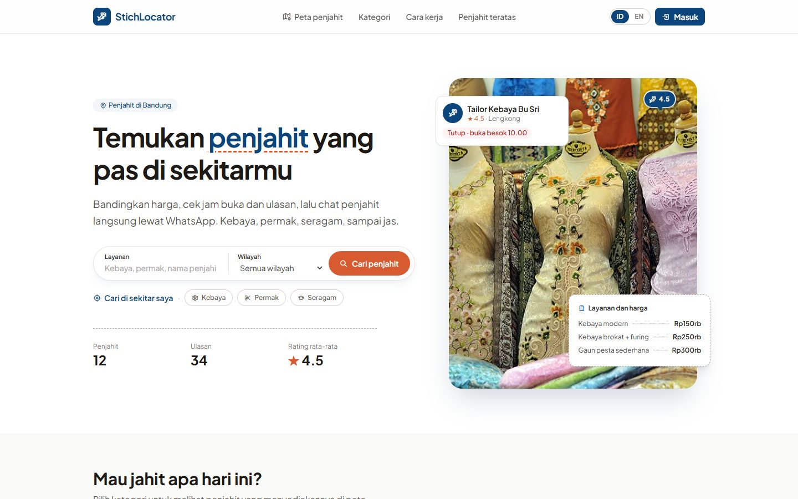
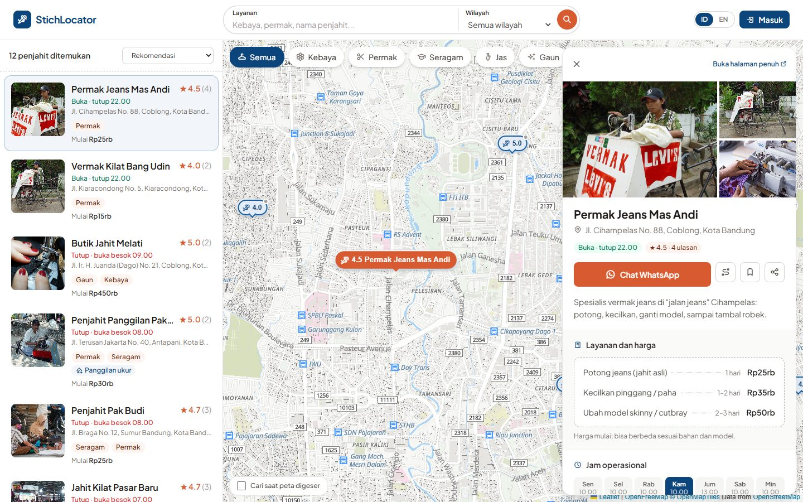
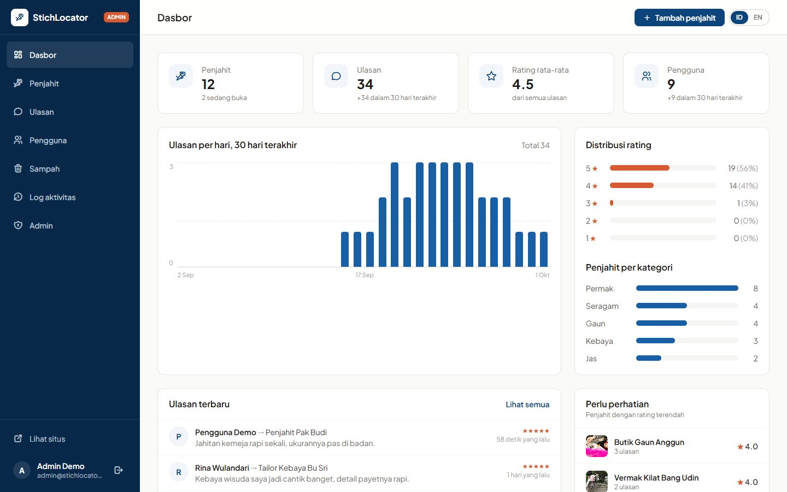

# 🧵 StichLocator

[](https://laravel.com)
[](https://tailwindcss.com)
[](https://leafletjs.com)
[](#-menjalankan-tes)

**StichLocator** adalah peta pencari penjahit di Kota Bandung. Pelanggan bisa membandingkan harga, mengecek jam buka, membaca ulasan, lalu langsung chat penjahit lewat WhatsApp. Penjahit mengelola halamannya sendiri lewat panel mitra, dan admin memoderasi semuanya dari panel admin.

> Awalnya tugas kuliah, lalu dikembangkan ulang menjadi proyek portofolio: desain baru, data Bandung, panel admin lengkap, dan akun mitra penjahit.

---

## 📌 Daftar Isi
- [Fitur](#-fitur)
- [Teknologi](#-teknologi)
- [Menjalankan secara lokal](#-menjalankan-secara-lokal)
- [Akun demo](#-akun-demo)
- [Menjalankan tes](#-menjalankan-tes)
- [Catatan keamanan & privasi](#-catatan-keamanan--privasi)
- [Screenshots](#-screenshots)

---

## ✨ Fitur

### 🗺️ Untuk pelanggan
- **Peta interaktif** bergaya bersih (vector tiles OpenFreeMap) dengan pin yang dikelompokkan saat diperkecil
- **Chip kategori** (kebaya, permak, seragam, jas, gaun), filter wilayah, harga, "buka sekarang", dan panggilan ukur ke rumah
- **Cari di sekitar saya** dengan radius 1–10 km, plus koreksi lokasi manual saat GPS browser kurang akurat
- **Detail "nota jahit"**: daftar harga & estimasi pengerjaan, jam buka per hari, galeri foto, ringkasan rating & tag ulasan
- **Pratinjau rute** di dalam aplikasi (OpenRouteService), lalu lanjut navigasi di Google Maps
- Ulasan dengan bintang & tag cepat, simpan penjahit favorit, bagikan link, dan laporkan ulasan yang tidak pantas
- Dua bahasa: **Indonesia / English**

### 🧑‍🔧 Untuk penjahit (panel mitra `/mitra`)
- Akun dibuat lewat **link undangan dari admin** (sekali pakai, berlaku 7 hari), yang juga berfungsi sebagai link atur ulang password
- Ubah sendiri profil usaha: info, lokasi, jam buka, layanan & harga, sampul, dan galeri. Perubahan langsung tayang.
- **Balas ulasan** pelanggan (tampil publik di bawah ulasan)
- **Libur sementara** sampai tanggal tertentu tanpa mengubah jadwal mingguan
- **Statistik 30 hari**: kunjungan halaman, klik WhatsApp, dan klik rute
- Daftar kelengkapan profil

### 🛠️ Untuk admin (`/admin`)
- Dasbor statistik: grafik ulasan harian, distribusi rating, penjahit per kategori, dan penjahit yang perlu perhatian
- Kelola penjahit dengan status **draf / terbit**, pencarian alamat (OpenStreetMap Nominatim), pengaturan urutan & kredit foto galeri, serta **kompresi foto otomatis** ke WebP
- Undang / cabut akses **mitra penjahit**
- Moderasi ulasan & **laporan ulasan** dari pengguna
- **Tempat sampah**: data terhapus bisa dipulihkan selama 30 hari, lalu dibersihkan otomatis
- **Log aktivitas** admin & mitra, **ekspor CSV**, kelola pengguna & akun admin

---

## 🧰 Teknologi
| Bagian | Teknologi |
|---|---|
| Backend | Laravel 11, PHP 8.2 |
| Database | SQLite (bawaan untuk development), MySQL juga didukung |
| Frontend | Blade, Tailwind CSS 3, Vite 6, JavaScript tanpa framework |
| Peta | Leaflet 1.9, Leaflet.markercluster, MapLibre GL 5 + OpenFreeMap (vector tiles) |
| Rute & alamat | OpenRouteService (lewat proxy server, API key tidak terekspos), Nominatim |
| Ikon & font | Tabler Icons, Plus Jakarta Sans |

---

## 🚀 Menjalankan secara lokal

Kebutuhan: **PHP 8.2+** (dengan ekstensi `gd`, `pdo_sqlite`), **Composer**, **Node.js 18+**.

```bash
git clone https://github.com/berryabdulghany/StichLocator.git
cd StichLocator

composer install
npm install

cp .env.example .env
php artisan key:generate

# Database SQLite + data demo 12 penjahit di Bandung
touch database/database.sqlite
php artisan migrate --seed

php artisan storage:link
```

Jalankan dua perintah ini di terminal terpisah:

```bash
php artisan serve
npm run dev
```

Buka http://localhost:8000.

**Opsional:**
- **Pratinjau rute:** isi `ORS_API_KEY` di `.env` (gratis di [openrouteservice.org](https://openrouteservice.org/dev/#/signup)). Tanpa key, rute ditampilkan sebagai garis lurus beserta perkiraan jarak.
- **Pembersihan otomatis tempat sampah (production):** jalankan scheduler Laravel lewat cron, yaitu `* * * * * php artisan schedule:run`.

---

## 🔑 Akun demo
Dibuat oleh `php artisan migrate --seed` (hanya untuk development lokal):

| Peran | Halaman login | Email | Password |
|---|---|---|---|
| Pengguna | `/login` | `user@stichlocator.test` | `password123` |
| Admin | `/admin/login` | `admin@stichlocator.test` | `password123` |
| Mitra penjahit | `/mitra/login` | `penjahit@stichlocator.test` | `password123` |

Nomor telepon data demo memakai awalan `0800`, jadi tombol WhatsApp tidak mengarah ke orang sungguhan. Foto berasal dari Wikimedia Commons; kreditnya ada di `public/images/penjahit/credits.json`.

---

## 🧪 Menjalankan tes
```bash
php artisan test
```
Sebanyak 86 feature test mencakup:
- data & jam buka penjahit
- halaman peta & detail
- ulasan & laporan ulasan
- panel admin: draf, galeri, sampah, ekspor CSV, log aktivitas
- akun mitra: undangan, balasan ulasan, libur sementara, statistik
- bahasa, keamanan, dan proxy rute

Tes memakai SQLite in-memory.

---

## 🔒 Catatan keamanan & privasi
- Tiga guard terpisah (`web`, `admin`, `tailor`). Mitra hanya bisa mengakses data penjahitnya sendiri, karena tidak ada ID penjahit di URL panel mitra.
- Token undangan disimpan sebagai hash SHA-256; link asli hanya ditampilkan sekali ke admin.
- Rate limiting di login, registrasi, ulasan, laporan, dan proxy rute; API key OpenRouteService tetap di server.
- Ekspor CSV dilindungi dari formula injection.
- Statistik tidak menyimpan data pribadi. Setiap pengunjung dihitung sekali per hari lewat session, dan bot, admin, serta pemilik halaman tidak dihitung.

---

## 📸 Screenshots
### Halaman Utama


### Popup Detail Penjahit


### Dashboard Admin

