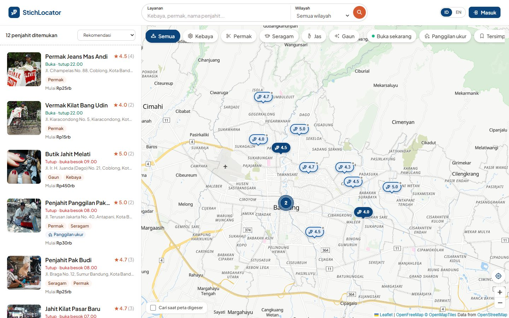
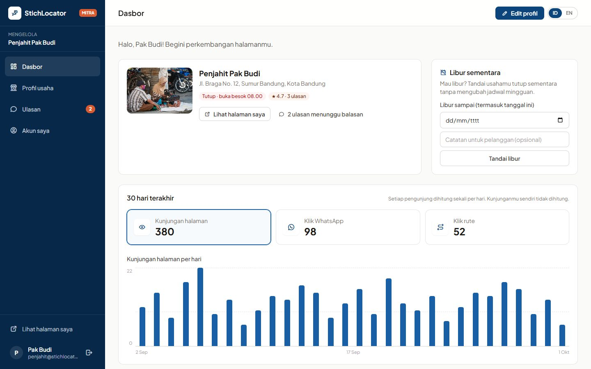
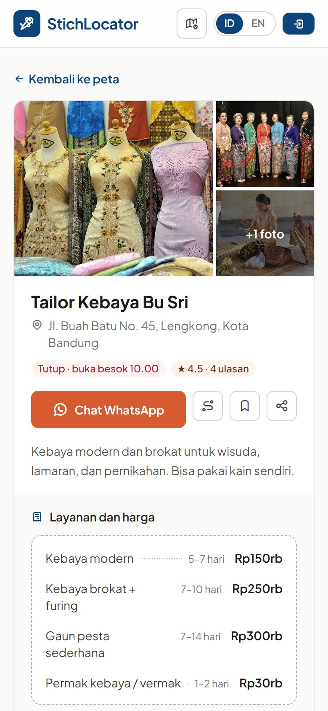

# 🧵 StichLocator

[](https://github.com/berryabdulghany/StichLocator/actions/workflows/tests.yml)
[](https://laravel.com)
[](https://www.php.net)
[](https://tailwindcss.com)
[](https://leafletjs.com)

**StichLocator** adalah peta pencari penjahit di Kota Bandung. Pelanggan bisa membandingkan harga, mengecek jam buka, membaca ulasan, lalu langsung chat penjahit lewat WhatsApp. Penjahit mengelola halamannya sendiri lewat panel mitra, dan admin memoderasi semuanya dari panel admin.

> 🇬🇧 *A tailor-finder map for Bandung, Indonesia. Customers compare prices, opening hours, and reviews, then chat with tailors on WhatsApp. Tailors manage their own listing through a partner panel; admins moderate everything. Built with Laravel 11, Tailwind CSS, and Leaflet + MapLibre.*


---

## 📌 Daftar Isi
- [Latar belakang](#-latar-belakang)
- [Fitur](#-fitur)
- [Screenshots](#-screenshots)
- [Teknologi](#-teknologi)
- [Menjalankan secara lokal](#-menjalankan-secara-lokal)
- [Akun demo](#-akun-demo)
- [Menjalankan tes](#-menjalankan-tes)
- [Struktur proyek](#-struktur-proyek)
- [Alur pengembangan](#-alur-pengembangan)
- [Catatan keamanan & privasi](#-catatan-keamanan--privasi)
- [Roadmap](#-roadmap)
- [Kredit](#-kredit)

---

## 💡 Latar belakang
Banyak penjahit masih mengandalkan pelanggan langganan dan promosi dari mulut ke mulut, sehingga sulit dijangkau pelanggan baru. Di sisi lain, pelanggan sulit mencari penjahit yang tepat: berapa harganya, kapan buka, bisa jahit kebaya atau tidak, dan bagus atau tidak hasilnya.

StichLocator menjawab kedua masalah itu dengan **peta yang khusus untuk penjahit**. Terinspirasi dari Google Maps, tapi informasinya disesuaikan untuk urusan jahit-menjahit: daftar harga per layanan, estimasi lama pengerjaan, panggilan ukur ke rumah, dan ulasan bertag ("rapi", "tepat waktu", ...).

> Awalnya tugas kuliah, lalu dikembangkan ulang menjadi proyek portofolio: desain baru, data Bandung, panel admin lengkap, akun mitra penjahit, dan tes otomatis.

---

## ✨ Fitur

### 🗺️ Untuk pelanggan
- **Peta interaktif** bergaya bersih (vector tiles OpenFreeMap) dengan pin yang dikelompokkan saat diperkecil
- **Chip kategori** (kebaya, permak, seragam, jas, gaun), filter wilayah, harga, "buka sekarang", dan panggilan ukur ke rumah
- **Cari di sekitar saya** dengan radius 1–10 km, plus koreksi lokasi manual saat GPS browser kurang akurat
- **Detail "nota jahit"**: daftar harga & estimasi pengerjaan, jam buka per hari, galeri foto, ringkasan rating & tag ulasan
- **Pratinjau rute** di dalam aplikasi (OpenRouteService), lalu lanjut navigasi di Google Maps
- Ulasan dengan bintang & tag cepat, simpan penjahit favorit, bagikan link, dan laporkan ulasan yang tidak pantas
- Dua bahasa: **Indonesia / English**

### 🧑‍🔧 Untuk penjahit (panel mitra `/mitra`)
- Akun dibuat lewat **link undangan dari admin** (sekali pakai, berlaku 7 hari), yang juga berfungsi sebagai link atur ulang password
- Ubah sendiri profil usaha: info, lokasi, jam buka, layanan & harga, sampul, dan galeri. Perubahan langsung tayang.
- **Balas ulasan** pelanggan (tampil publik di bawah ulasan)
- **Libur sementara** sampai tanggal tertentu tanpa mengubah jadwal mingguan
- **Statistik 30 hari**: kunjungan halaman, klik WhatsApp, dan klik rute
- Daftar kelengkapan profil

### 🛠️ Untuk admin (`/admin`)
- Dasbor statistik: grafik ulasan harian, distribusi rating, penjahit per kategori, dan penjahit yang perlu perhatian
- Kelola penjahit dengan status **draf / terbit**, pencarian alamat (OpenStreetMap Nominatim), pengaturan urutan & kredit foto galeri, serta **kompresi foto otomatis** ke WebP
- Undang / cabut akses **mitra penjahit**
- Moderasi ulasan & **laporan ulasan** dari pengguna
- **Tempat sampah**: data terhapus bisa dipulihkan selama 30 hari, lalu dibersihkan otomatis
- **Log aktivitas** admin & mitra, **ekspor CSV**, kelola pengguna & akun admin

---

## 📸 Screenshots

<table>
  <tr>
    <td width="50%"><br><sub><b>Halaman utama:</b> pencarian layanan & wilayah</sub></td>
    <td width="50%"><br><sub><b>Peta:</b> chip kategori, daftar, dan pin rating</sub></td>
  </tr>
  <tr>
    <td width="50%"><br><sub><b>Panel admin:</b> statistik & moderasi</sub></td>
    <td width="50%"><br><sub><b>Panel mitra:</b> statistik 30 hari & libur sementara</sub></td>
  </tr>
</table>

<p align="center">
  <br>
  <sub><b>Tampilan HP:</b> halaman detail penjahit</sub>
</p>

---

## 🧰 Teknologi
| Bagian | Teknologi |
|---|---|
| Backend | Laravel 11, PHP 8.2+ |
| Database | SQLite (bawaan untuk development), MySQL juga didukung |
| Frontend | Blade, Tailwind CSS 3, Vite 6, JavaScript tanpa framework |
| Peta | Leaflet 1.9, Leaflet.markercluster, MapLibre GL 5 + OpenFreeMap (vector tiles) |
| Rute & alamat | OpenRouteService (lewat proxy server, API key tidak terekspos), Nominatim |
| Ikon & font | Tabler Icons, Plus Jakarta Sans |
| CI | GitHub Actions (build + tes di PHP 8.2 & 8.3) |

---

## 🚀 Menjalankan secara lokal

Kebutuhan: **PHP 8.2+** (dengan ekstensi `gd`, `pdo_sqlite`), **Composer**, **Node.js 18+**.

```bash
git clone https://github.com/berryabdulghany/StichLocator.git
cd StichLocator

composer install
npm install

cp .env.example .env
php artisan key:generate

# Database SQLite + data demo 12 penjahit di Bandung
touch database/database.sqlite
php artisan migrate --seed

php artisan storage:link
```

Jalankan dua perintah ini di terminal terpisah:

```bash
php artisan serve
npm run dev
```

Buka http://localhost:8000.

**Opsional:**
- **Pratinjau rute:** isi `ORS_API_KEY` di `.env` (gratis di [openrouteservice.org](https://openrouteservice.org/dev/#/signup)). Tanpa key, rute ditampilkan sebagai garis lurus beserta perkiraan jarak.
- **Pembersihan otomatis tempat sampah (production):** jalankan scheduler Laravel lewat cron, yaitu `* * * * * php artisan schedule:run`.

---

## 🔑 Akun demo
Dibuat oleh `php artisan migrate --seed` (hanya untuk development lokal):

| Peran | Halaman login | Email | Password |
|---|---|---|---|
| Pengguna | `/login` | `user@stichlocator.test` | `password123` |
| Admin | `/admin/login` | `admin@stichlocator.test` | `password123` |
| Mitra penjahit | `/mitra/login` | `penjahit@stichlocator.test` | `password123` |

Nomor telepon data demo memakai awalan `0800`, jadi tombol WhatsApp tidak mengarah ke orang sungguhan.

> **Mencoba statistik mitra?** Kunjungan dari admin dan dari penjahit pemilik halaman sengaja tidak dihitung. Buka halaman penjahit dari jendela incognito tanpa login.

---

## 🧪 Menjalankan tes
```bash
php artisan test
```
Sebanyak 86 feature test mencakup:
- data & jam buka penjahit
- halaman peta & detail
- ulasan & laporan ulasan
- panel admin: draf, galeri, sampah, ekspor CSV, log aktivitas
- akun mitra: undangan, balasan ulasan, libur sementara, statistik
- bahasa, keamanan, dan proxy rute

Tes memakai SQLite in-memory. Tes yang sama juga dijalankan otomatis oleh **GitHub Actions** (PHP 8.2 & 8.3) di setiap push ke `main` dan setiap pull request; lihat [`.github/workflows/tests.yml`](.github/workflows/tests.yml).

---

## 🗂️ Struktur proyek
Hanya bagian yang paling penting:

```
app/
├── Http/Controllers/
│   ├── Admin/            # panel admin: penjahit, ulasan, pengguna, sampah, log, undangan mitra
│   ├── Mitra/            # panel mitra penjahit: dasbor, profil, ulasan, libur, akun
│   └── ...               # halaman publik: peta, detail, ulasan, rute, statistik klik
├── Models/               # Location (penjahit), Review, TailorAccount, TailorInvitation, ...
└── Support/              # TailorEditor, TailorStats, ImageOptimizer, Activity (log), ...
resources/
├── js/                   # explorer.js (peta), detail.js, admin.js, lib/ (leaflet, map, track, ...)
└── views/
    ├── explore/ penjahit/ # halaman peta & detail ("nota jahit")
    ├── admin/ mitra/     # panel admin & mitra (layout bersama: layouts/panel)
    └── shared/           # form profil penjahit & form akun yang dipakai kedua panel
database/seeders/         # 12 penjahit demo di Bandung + akun demo
tests/Feature/            # 86 feature test
```

---

## 🔀 Alur pengembangan
Setiap fitur dikerjakan di **branch terpisah** (`feat/...`, `fix/...`, `ci/...`), lalu masuk ke `main` lewat **pull request**. Setiap PR otomatis dicek oleh GitHub Actions (build frontend + seluruh tes), dan baru di-merge setelah semua centang hijau.

Contoh riwayat: `feat/fondasi-desain` → `feat/halaman-peta` → `feat/rute-lokasi` → `feat/landing-page` → `feat/admin-panel` → `feat/admin-lanjutan` → `feat/akun-penjahit` → `ci/github-actions`.

---

## 🔒 Catatan keamanan & privasi
- Tiga guard terpisah (`web`, `admin`, `tailor`). Mitra hanya bisa mengakses data penjahitnya sendiri, karena tidak ada ID penjahit di URL panel mitra.
- Token undangan disimpan sebagai hash SHA-256; link asli hanya ditampilkan sekali ke admin.
- Rate limiting di login, registrasi, ulasan, laporan, dan proxy rute; API key OpenRouteService tetap di server.
- Ekspor CSV dilindungi dari formula injection; semua konten pengguna di-escape.
- Statistik tidak menyimpan data pribadi. Setiap pengunjung dihitung sekali per hari lewat session, dan bot, admin, serta pemilik halaman tidak dihitung.

---

## 🛣️ Roadmap
- [ ] Deploy online dengan link demo publik
- [ ] Notifikasi email (ulasan baru untuk mitra, lupa password tanpa lewat admin)
- [ ] Penjahit favorit tersimpan di akun (saat ini di browser)
- [ ] Halaman SEO per kategori & wilayah, misalnya "Penjahit kebaya di Coblong"

---

## 🙏 Kredit
- Versi awal dibuat sebagai tugas kuliah bersama tim (repositori asal: [Ocauwyn/StichLocator](https://github.com/Ocauwyn/StichLocator)), lalu dikembangkan ulang oleh [@berryabdulghany](https://github.com/berryabdulghany).
- Data peta © [OpenStreetMap](https://www.openstreetmap.org/copyright) contributors, tiles dari [OpenFreeMap](https://openfreemap.org) / OpenMapTiles.
- Foto penjahit dari [Wikimedia Commons](https://commons.wikimedia.org); kredit & lisensi tiap foto ada di `public/images/penjahit/credits.json` dan ditampilkan di halaman detail.
- Data penjahit di seeder adalah **data fiktif** untuk demo; nama usaha, alamat, dan ulasan tidak mewakili usaha sungguhan.
